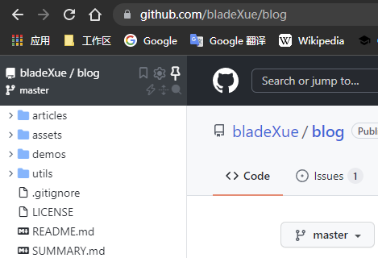

# 算法每日一练

收集各类算法解法，[SUMMARY.md](./SUMMARY.md)是总集目录，不定期更新，目标日更。

## 如何使用此项目

欢迎fork和issue，希望这个项目可以通过大家的努力正常起来，作为一份靠谱的算法学习资料。

所有题目都以笔记的形式存放在[`questions/`](./questions/)目录下，各个子目录名为题目名，为了统一提交风格，[`template/`](./template/)演示了每个题目目录应该遵循的一个模板：

1. 拥有描述文件`README.md`，记录题目的来源，难度⭐⭐⭐⭐⭐，问题描述，分析，题解链接（单独划分目录）和其它。其典型布局如下：
```TXT
ALGORITHM.EVERYDAY\template
|   info.json
|   README.md
|
\---solutions
    +---dict-check-in-java
    |       README.md
    |       Solution.java
    |
    \---double-for-in-java
        |   README.md
        |   Solution.java
        |
        \---images
                两数之和.jpg
```
2. 拥有配置文件`info.json`，描述题目附属信息，提供给`utils/summary.py`生成目录信息，主要格式如下：
```json
{
    "release": true, ;; 是否已经完成
    "title": "两数之和", ;; 题目
    "description": "一道入门的简单题", ;; 简短描述
    "date": "2100-01-01 00:00:00", ;; 日期
    "tags": [ 
        "求和", 
        "入门" ;; 可以拥有多个标签
    ],
    "categories": [
        "Leetcode" ;; 只能拥有一个分类
    ]
}
```

## 生成目录

根目录执行：

```shell 
python utils/summary.py
```

索引所有的`info.json`来生成目录文件`SUMMARY.md`。

## 阅读插件

> 为了增加阅读体验，建议安装[Octotree Code Tree](https://www.octotree.io/)这个Chrome插件，它会在浏览器左侧生成GitHub仓库的目录树



## 贡献人

- [zj xue](https://github.com/bladeXue)

*欢迎贡献签名*
