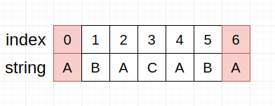
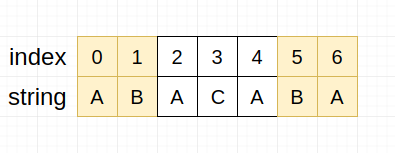
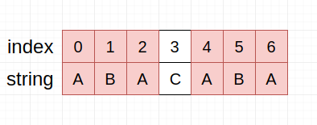
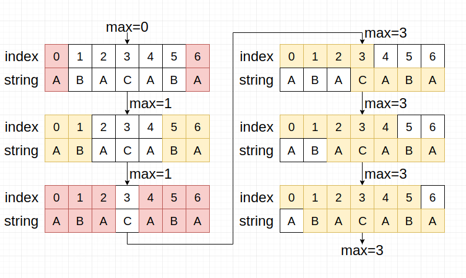

# Leetcode-1392.最长快乐前缀

> 题目来源：[LeetCode-1392.最长快乐前缀](https://leetcode-cn.com/problems/longest-happy-prefix/) 
>
> 题目难度：⭐⭐⭐⭐

## 问题描述

“快乐前缀”是在原字符串中既是**非空**前缀也是后缀（不包括原字符串自身）的字符串。

给你一个字符串`s`，请你返回它的**最长快乐前缀**。

如果不存在满足题意的前缀，则返回一个空字符串。

### 示例 1：
```
输入：s = "level"
输出："l"
解释：不包括s自己，一共有4个前缀（"l"，"le"，"lev"，"leve"）和4个后缀（"l"，"el"，"vel"，"evel"）。最长的既是前缀也是后缀的字符串是"l"。
```
### 示例 2：
```
输入：s = "ababab"
输出："abab"
解释："abab"是最长的既是前缀也是后缀的字符串。题目允许前后缀在原字符串中重叠。
```
### 示例 3：
```
输入：s = "leetcodeleet"
输出："leet"
```
### 示例 4：
```
输入：s = "a"
输出：""
```
### 提示：

- `1 <= s.length <= 10^5`
- `s`只含有小写英文字母

## 简要分析

快乐前缀其实是KMP算法中next[]数组的一个子问题，其要求某字符串的前缀和后缀一致，属于**字符串**算法的一类，最简单的方案是双重循环，但是会产生过多的消耗，目前常规使用的称为**递推法**，是基于快乐前缀增长的一个性质来进行递归完成的。

## 题解

### 1. 双重for循环

也就是**暴力解法**，同时从字符串的首部和尾部截取长度为1的子串来进行比较，记录下其是否满足快乐前缀，然后逐渐长度+1，直到子串和字符串一致长度，在各长度的记录中寻找最大值，就是最长快乐前缀了。

给定字符串`"abacaba"`，其Java示例如下：

```JAVA
public class MaxPrefix {

    public static void main(String[] args) {

        String s = "abacaba";
        int len = s.length();

        for (int m = 1; m < len; m++) {
            for (int i = 0, j = len - m; i < m && j < len; i++, j++) {
                if (s.charAt(i) != s.charAt(j)) {
                    break;
                }
                if (i == m - 1) {
                    // 如果存在共缀则输出共缀长度
                    System.out.println(m);
                }
            }
        }
    }
}
// 最终输出
// 1
// 3
```

对于上面的代码，走一遍流程：

1. 扫描字符串，首先考虑子串长度为1，那我们直接比较首尾字符就行了，也就是S\[0\]和S\[6\]，我们发现都是A，所以有快乐前缀成立，为A，长度为1，如下所示：



1. 考虑是否有更长的子串，于是我们将考量长度+1，开始考虑S\[0.\.2\]和S\[5.\.7\]，发现并不匹配，所以不存在长度为2的快乐前缀，如下所示（黄色表示失败）：



3. 继续查找更长的子串，在长度为3的子串中，发现匹配了，如下图所示：



4. 接下来继续尝试长度为4和5和6，但是均为失败，扫描结束。得到快乐前缀的最大值就是之前测到的`"ABA"`，长度为3，完整流程一览（结果进行了涂色，红色表示存在快乐前缀）： 



### 2. 递推数组法

还是观察`"ABACABA"`这个字符串，当前缀长度=`1`时，我们比较的是首部的`"A"`和尾部的`"A"`，快乐前缀为`1`；当前缀长度=`2`时，我们比较的是首部的`"AB"`和尾部的`"BA"`，不存在快乐前缀；当前缀长度=`3`时，我们比较的是首部的`"ABA"`和尾部的`"ABA"`，快乐前缀为`3`。

我们把存在**快乐前缀**的字符串称为**快乐字符串**（如`"ABABA"`就是一个快乐字符串），你可能已经观察出来了，快乐前缀的增长表现出来一个性质：**在快乐字符串中，其长度大于`1`的快乐前缀，其本身是一个快乐字符串**

如`"ABACABA"`，它是一个快乐字符串，拥有长度为`3`的快乐前缀`"ABA"`，而`"ABA"`作为子串，拥有一个长度为`1`的快乐前缀`"A"`。这种增长性可以用地推数组来实现。

[Java示例](./recurrence-solution/RecurrenceSolution.java)如下：

```JAVA
class Solution {

    static int[] getMax(String pat) {

        int len = pat.length();
        int[] max = new int[len];
        max[0] = 0;

        int i = 0;  // 表示当前最大共缀长度的候选值
        int j = 1;  // 从第二位开始遍历

        while (j < len) {

            if (pat.charAt(i) == pat.charAt(j))
                max[j++] = ++i;
            else if (i == 0)
                max[j++] = 0;
            else
                i = max[i - 1]; // 递推核心
        }

        return max;
    }

    public String longestPrefix(String s) {

        int len = s.length();

        if (len < 2) {
            return "";
        } else {
            return s.substring(0, getMax(s)[len - 1]);
        }
    }
}
```

提交结果，可以看到整体效率还是比较高的：


## 总结

暂无
